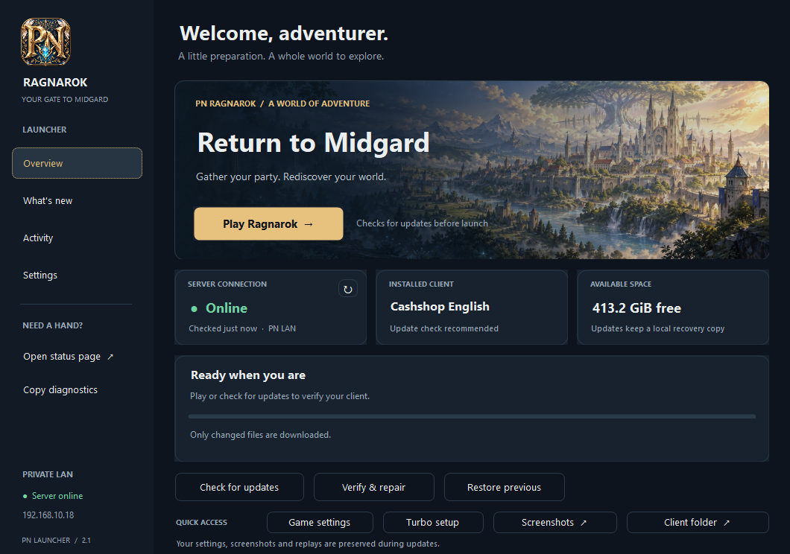
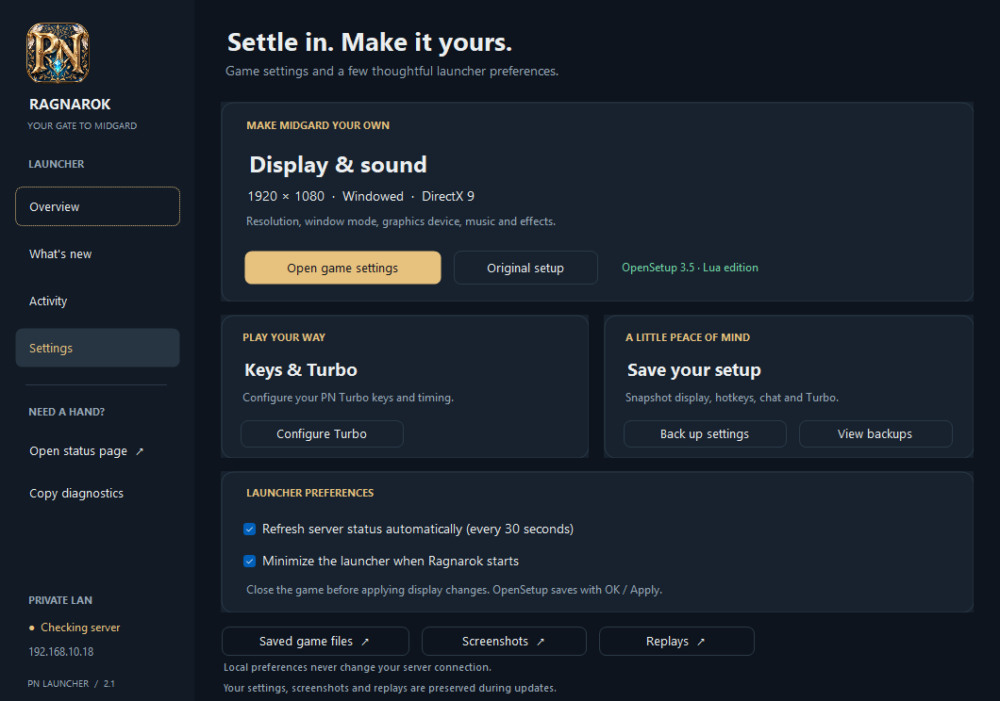
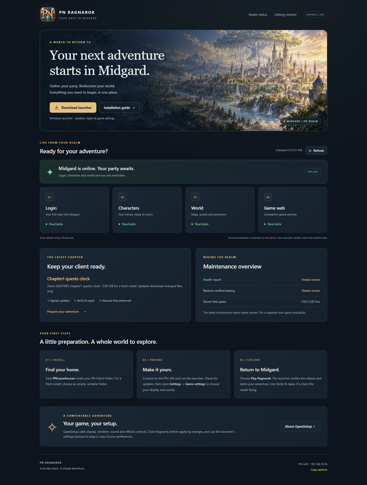

# PN LAN launcher

*Native dashboard render with an illustrative online state.*

The [5 October client release](https://github.com/patnawa/rathena_pn/releases/tag/client-2026-10-05-midgard)
provides the full client in three 7-Zip volumes, `PN-Launcher-20261005.zip`
for existing clients, and the standalone bootstrap. See the
[release installation guide](../../doc/releases/client-2026-10-05-midgard.md).

The 2.1 dashboard uses a navy-and-gold Midgard illustration, a prominent Play
button, live LAN status, installed-release notes and available disk space.
Game settings, Turbo Setup, screenshots and the client folder are one click
away. Activity is kept in `.pn-updater/launcher.log` (the latest 160 entries);
Copy Diagnostics includes the installed release, folder, connection, free
space and recent results. Enter plays from Overview; F5 checks for updates;
Escape cancels a check or download. Cancellation cleans the staging folder
and is disabled once journaled installation starts. A checksum already in
progress finishes before cancellation takes effect. Download progress shows
received bytes, average speed and an approximate remaining time.

Build the dashboard with `build.ps1 -Output ABSOLUTE_DIRECTORY`, then use
`install-dashboard.ps1 -Build ABSOLUTE_BUILD_DIRECTORY -ClientRoot ABSOLUTE_PN_CLIENT_DIRECTORY`.
The installer adds `PNLauncher-20261005.exe`, `Launch PN Dashboard.cmd`,
`PN Launcher.lnk`, `PN Ragnarok.lnk` and `PN-Branding/`. The launcher has an
embedded Midgard PN icon, also shown in the sidebar; the game shortcut uses
the matching ivory Valkyrie-wing Ragnarok crest and
the existing Start Game readiness checks. Original bootstrap/game executables
and signed launch scripts are preserved. The refined bootstrap is also available
from the LAN status page. These additions do not change the signed LAN file
manifest; distributing the versioned dashboard and OpenSetup through that
manifest is a separate release operation. Use the new shortcut locally so the existing signed feed
cannot reset the entry point to the older launcher.

The selected icons and source PNGs are in `assets/midgard/`. Build and install
use this set by default. Both ICO files contain 16, 24, 32, 48, 64, 128 and
256 px RGBA images. Repackage the source artwork with
`pack-premium-icons.ps1 -Assets ABSOLUTE_MIDGARD_ASSETS_DIRECTORY`.
Small ICO frames use uncompressed 32-bit DIB images for .NET Framework
compatibility; the 256 px frame uses PNG. The sidebar has its own embedded
256 px PNG so it renders the same artwork cleanly at every display scale.
The ImageGen refinement prompts are retained in `generation-prompts.json`.
Previous designs and their generators remain in `assets/` for reference.
The manifest enables Windows DPI scaling without requesting elevation.

The Settings page prefers `PNOpenSetup.exe`, with the original `Setup.exe`
available separately. `install-dashboard.ps1` installs the official stable
OpenSetup 3.5.0.692 Lua edition without telemetry, checks a pinned archive
SHA-256 and retains the author's license, documentation and provenance in
`PN-Tools/OpenSetup/`. `-OpenSetupArchive ABSOLUTE_ZIP_PATH` supports an offline
install; `-SkipOpenSetup` installs only the dashboard. The standalone
`install-opensetup.ps1 -ClientRoot ABSOLUTE_PN_CLIENT_DIRECTORY` installs just
the settings tool. Source: [RO OpenSetup](https://nn.ai4rei.net/dev/opensetup/#download).
Release archives include the integration scripts and fetch OpenSetup directly
from its author; the upstream binary is not mirrored on GitHub.

`PNOpenSetup.ini` selects `LuaSaveData=1`, English and DirectX 9 for this PN
client. Existing INI preferences are preserved on reinstall. No `/defaults`
or first-run save is performed in the live client. Personal
`savedata/OptionInfo.lua`, Turbo preferences, original Setup.exe, Ragexe.exe,
DATA.INI and connection configuration are untouched by installation.
Close Ragnarok before opening game settings; OpenSetup saves with OK/Apply.
Native save compatibility was exercised in an isolated copy containing the
client's System and SystemEN OptionInfo.lub files. All 92 existing setting keys
were retained; display/device choices were refreshed by native enumeration.
This does not certify a complete in-game session on every graphics adapter.

Settings can snapshot display, hotkeys, chat, UI and PN Turbo into
`.pn-updater/settings-backups/`. Snapshots never overwrite the source. To
restore a snapshot, close the game and settings tools, then copy the desired
files back to their corresponding client paths. Launcher preferences for
automatic status refresh and minimizing after Play are stored independently
in `.pn-updater/launcher-settings.json`. No launcher preference changes a
server address or account configuration.

The matching responsive status page is in `tools/admin/lan_client_status/`.
Deploy that entire directory beside `lan_client_service.py`. Its CSS, JS and
images use explicit public routes; health reports and arbitrary local files
remain inaccessible. `/client-info.json` returns only the published release
name, total size and file count. A stale maintenance report clears historical
disk/backup values; a failed or stale live response clears prior green service
indicators. Game availability and maintenance/backup health are independent.
The existing signed release and immutable object routes are retained.
Service regression checks: `python -m unittest discover -s tools/admin -p test_lan_client_service.py -v`.

`PNLauncherCheck.exe --render-preview OUTPUT_PNG [CLIENT_ROOT] [STATE] [SCALE]`
renders an off-screen dashboard without network calls or installation.
States are `ready`, `online`, `downloading`, `error`, `notes`, `activity`, `settings`;
scale is between 1 and 2. Online/download states are illustrative fixtures.
Previewing a root creates `.pn-updater` if absent, but does not write client
manifests, logs or release files. Build self-tests include cancellation before
a request and during a real loopback HTTP download, in addition to existing
signature, path, cache and recovery checks.

`PNLauncher.exe` installs, updates, verifies, repairs and starts the complete
Windows client from `http://192.168.10.18:8082/`. Save the bootstrap executable
in an empty writable directory for a fresh installation, or use the supplied
`Launch PN.cmd` inside PN-Client. No additional .NET download is needed on this
Windows installation; the build targets .NET Framework 4.x.

The release envelope uses RSA-3072/SHA-256 and the embedded public key. The
private publisher key stays in the developer's user-only `.ssh` directory.
Every downloaded object is verified by length and SHA-256 before installation.
The launcher rejects redirects, invalid paths, reparse points and older feed
sequences. Initial bootstrap trust comes from the local client or this LAN
server; the executable does not silently replace itself. A launcher upgrade can
ship under a new versioned filename, with Launch PN.cmd selecting that version
on its next run while preserving PNLauncher.exe.

Updates hash the installed release and fetch only changed files. Within one launcher session, checksums for files of at least 8 MiB are reused while read-only Windows handles prevent changes. Each lookup verifies the current file identity. Repair forces new hashes; update activation and rollback release these handles before replacing files. Closing the launcher releases all handles. An interrupted
installation restores its journaled originals on the next run. A completed
version update keeps one previous version for Rollback; same-version Repair
does not erase that backup. First installation has no previous version. A
rollback retains the highest feed sequence, preventing replay of an old network
release. The next Update reinstalls the current published version.
Rollback and pending recovery preflight the complete file set before mutation.
If it would replace or delete the running versioned launcher, the operation
refuses without changing files or creating a rollback journal. Close that
launcher and use the preserved PNLauncher.exe to complete the rollback.

The publisher lists release files from the clean manifest, never by enumerating
the user's installation. Savedata, screenshots, replays and updater state cannot
appear in the signed feed. Existing AI settings and BankUI.ini are preserved.
Do not share a personal folder's savedata/screenshots when a clean download is
preferred. PN-Client is approximately 4.99 GiB; server development files are
outside it. Large future GRF updates need free space for the downloaded archive
and the previous version retained for rollback.

Build: `powershell -File build.ps1 -Output ABSOLUTE_DIRECTORY`. This also runs
the development console self-tests for signature/path rejection, interrupted
updates, idempotent recovery and preservation/promotion of rollback files.
`PNLauncherCheck.exe` belongs in development output only. A real LAN repair was
also tested by replacing and restoring the small FONT-FIX.txt file through the
signed object feed; no GRF was downloaded for that repair.

The LAN service is `tools/admin/lan_client_service.py`, installed as
`pn-lan-client.service`. Publisher and deployment evidence live in the workspace
`Server-Development/improvements-20260919` directory. There are no external
alerts or public-network endpoints in this release.
