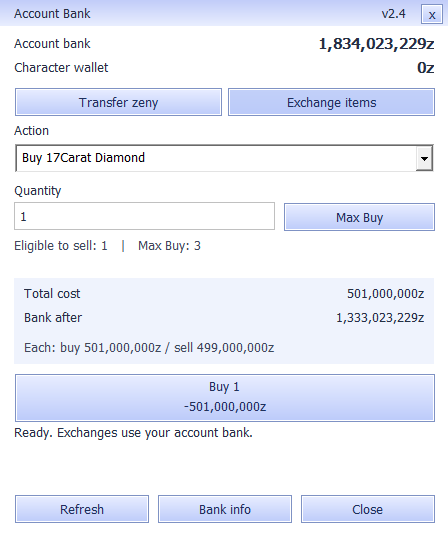
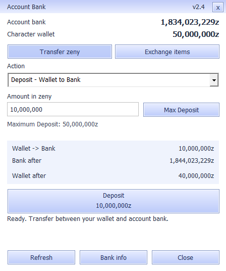

# Account Bank v2.4 — 21 September 2026

The bank panel separates wallet transfers from item exchanges. Selecting an action reveals one amount input, its matching Max button, exact total and resulting bank balance. Transfers also show the resulting wallet. The selected action and quantities are remembered while changing views, and reset on character changes.

Amounts accept plain digits or correctly comma-grouped whole numbers. Formatting occurs on focus loss, preserving the caret during typing. Parsing remains checked signed 64-bit integer arithmetic; invalid commas, decimal amounts, signs and overflow are rejected. Max fills the selected action's latest server-provided limit without submitting.

The balance preview uses the shared checked transaction planner. Unverified, invalid and pending states suppress the projected balances. The server remains authoritative, including revalidation after a queued balance refresh. Transaction requests, SQL behavior, item eligibility, prices and the v2 wire protocol are unchanged.

A saved receipt requires the matching request ID, session nonce and successful server result. Saving, explicit rejection, an unrelated older reply, changed session and disconnect cannot create a receipt. A disconnected operation can be confirmed by a later authenticated reply for that same request. Explicit rejection clears attribution even when the server retains its previous request ID, preventing a later native operation from being mislabeled. Receipts persist through automatic refresh and clear on the next submitted transaction or character change; the displayed receipt balance is the value at confirmation.

At 100%, the panel measures 450 × 538 pixels including its border. The bank follows the game's DPI context within 100–150%; `UiScale=125` or `UiScale=150` under `[Bank]` in BankUI.ini overrides the size after restart. It scales controls and fonts together without changing the game's global DPI or font settings. Gradient painting reuses a stock DC pen instead of allocating a pen for every scanline. Unchanged background refreshes still avoid repaint and control enable-state churn.

Verification uses the actual Win32 controls, shipping transport hooks, delayed and fragmented loopback replies, and installed font/loader DLLs. Coverage includes all six actions, view/dropdown selection, exact previews, Max without submission, comma parsing and caret position, invalid/overflow values, receipt attribution, disconnect and session changes, duplicate-click guards and fresh-snapshot revalidation. Layout and maximum-length values are checked at 100%, 125% and 150%, with native synthetic renderings for each size. The installed native reference font test covers loader compatibility and font isolation.

The reproducible Windows build is `client-patch/account_bank/build.ps1`. Run `bank_ui_test.exe 100`, `125` and `150`, plus `bank_transport_test.exe`, `bank_refresh_test.exe` and `bank_loader_test.exe` from the output directory. The loader test needs the installed FontScale.dll and FontScaleOriginal.dll beside BankUI.dll. The existing shell build remains available.

Detailed release evidence, candidate DLL, rollback copies and the update package are retained outside Git at `Server-Development/bank-ui-v24-20260921`. The local installer changes only BankUI.dll and release/help manifests; the signed LAN release reuses the existing clean object set. No game-server restart or schema migration is required. These automated and native rendering checks are separate from a manual Ragexe gameplay acceptance pass.
