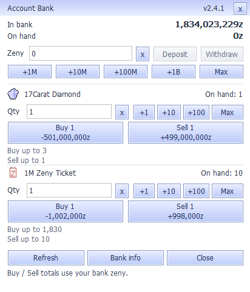

# Bank v2.4.1 — repeat amount entry and compact layout

After a deposit or withdrawal, v2.4 left grouping separators in the amount field when the user returned to edit it. Appending a zero to `1,000,000` produced `1,000,0000`, which correctly failed the strict parser but made normal editing awkward. Clearing the field also immediately showed a validation warning in the new transfer view. The user reported this warning and preferred the earlier interface.

v2.4.1 restores the compact panel with all six transaction buttons visible, the original preset buttons and the Max menus. Amounts are ungrouped when focus returns, then grouped on focus loss. Valid pasted/grouped replacements are normalized after the native edit operation completes. Digit edits and Backspace/Delete on valid grouped input preserve the numeric value and selection positions. Ctrl+A selects the complete amount. Empty entry stays a neutral editing state; zero, malformed, negative and overflowing amounts still cannot be submitted.

Confirmed receipts, 100–150% scaling, exact signed exchange totals, SQL transaction safeguards, queued-click revalidation and duplicate protection are retained. Receipt success still requires the exact request ID and session nonce. No server protocol, price, SQL or inventory-rule changes are involved.

The regression uses native Windows focus, character, selection and button messages to deposit, refocus and append, deposit again, backspace, withdraw, replace the amount and submit another transfer. It verifies each exact request and completion receipt. The v2.4 build fails the first append-after-deposit assertion; the corrected build passes, including grouped replacement, malformed-input rejection and Ctrl+A replacement. Existing production UI and delayed/fragmented transport suites also pass. Layout, maximum balances and totals are checked at 100%, 125% and 150%, and native renderings are inspected.

Build with `client-patch/account_bank/build.ps1`; run `bank_reentry_test.exe`, `bank_ui_test.exe 100` (also `125`, `150`), `bank_transport_test.exe`, `bank_refresh_test.exe` and `bank_loader_test.exe`. The loader test uses the installed font/loader DLLs. The Unix build also includes `BankReentryTest.exe`.

Evidence and release artifacts are retained outside Git in `Server-Development/bank-ui-v241-20260921`. This is a client-only update. Manual in-game acceptance of the corrected build remains separate from the native control and loopback tests.
